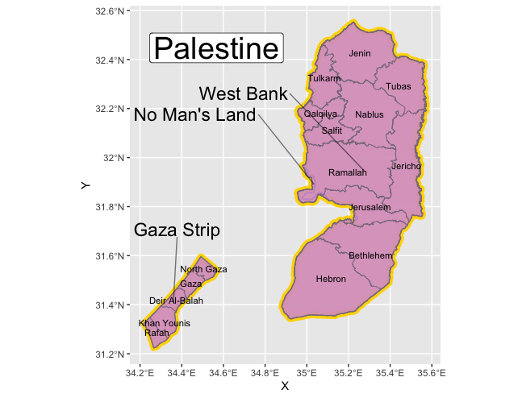
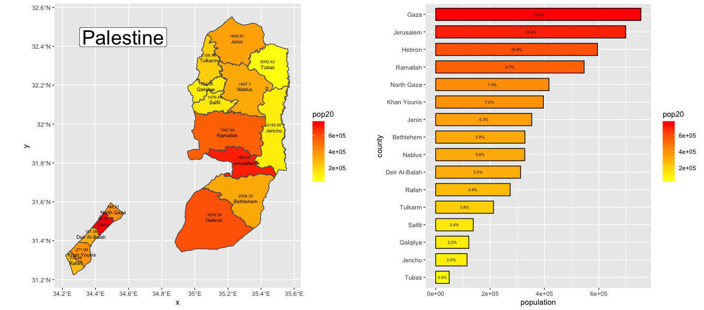
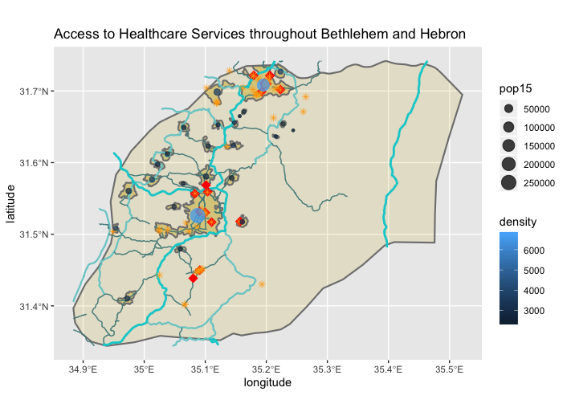
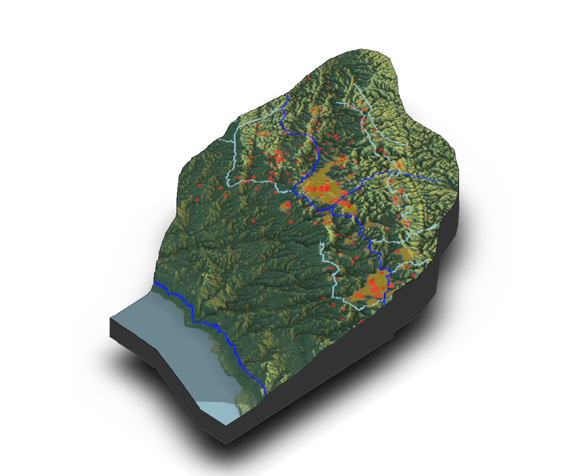

# Palestine

## Administrative Subdivisions of Palestine

## Population of Palestine's Counties

## Access to Healthcare in Bethlehem and Hebron

The total population of Hebron and Bethlehem is 815,559, with 542,013 people in Hebron and 273,546 people in Bethlehem.  There are 50 distinctly defined urban areas total.  
- There are two large, high density areas, the cities of Bethlehem and Hebron themselves, surrounded by lower density smaller suburbs.  There are about 250,000 people living in Hebron, almost half of the total population.  There are about 157,000 people living in Bethlehem, which is slightly more than half of the total population of the area.  Bethlehem and Hebron are similarly dense, with Hebron about 6600 people per square kilometer and Bethlehem with about 6700 people per square kilometer.  Hebron is physically larger than Bethlehem, with an area of about 38 square kilometers whereas Bethlehem’s area is 23 square kilometers.  The other 48 urban areas are all smaller suburbs, with densities ranging from 1640 people per square kilometer to almost 4,000 people per square kilometer.  
- Roadways connect urban areas and suburbs, but rural areas remain relatively isolated, especially in the eastern portion of the region.  Hospitals and government health sites are also highly concentrated in the two largest urban areas, with government health sites being slightly more spread out. Access to healthcare from urban areas is decent, although from the suburbs travel is required.  From rural areas, access to healthcare is limited, as there are not large paved roads connecting most rural areas.  

## Topography in Palestine

In Hebron and Bethlehem, Palestine, urban areas are at a higher altitude that the average altitude for the region.  The cities of Hebron and Bethlehem are both at the highest altitude points for their respective regions, and the suburban areas surrounding them stay at higher altitudes.  There are no urban areas near the Dead Sea, which is logically surrounded by the lower altitudes in the region.  This is counterintuitive because urban areas tend to concentrate nearer to bodies of water, not further away from them.  

Topography has impacted the development of roads in Palestine to the same extent that it has impacted the development of urban areas: roads serve to connect urban areas which are concentrated at higher altitude areas. There is one main road that runs all through Palestine along the border of the Dead Sea, connecting Northern and Southern Israel, but it does not connect to transportation facilities at higher altitudes.  

Health care facilities are concentrated in urban areas, and remain solely at higher altitudes.  It is important to note that Israeli settlements are also concentrated in these areas, and that there may be a causal relationship between these settlements and better health care facilities for residents.  There are no healthcare facilities at lower altitudes near the Dead Sea.  

The three-dimensional map of Palestine included the Dead Sea, which was not shown by my previous maps.  There are no urban areas bordering the Dead Sea, which is odd, but could be due to the fact that it is salt water, and that it is not used for many modern day trading routes.  It was also interesting to note that urban areas, along with roads and healthcare facilities, are primary concentrated in high altitude areas.  
